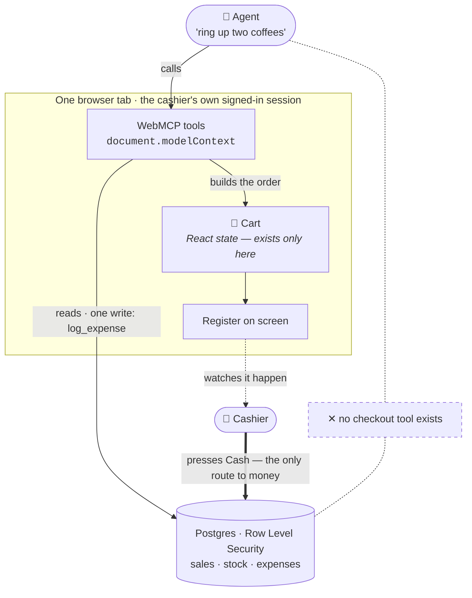

# POS System — with a WebMCP agent interface

A working point-of-sale system — cashier register, inventory, admin dashboard,
expense reports — built on Next.js and Supabase, where the pages themselves
register [WebMCP](https://webmachinelearning.github.io/webmcp/) tools. An agent
can read the shop's numbers and **operate the register the cashier is looking
at**, live, in the same tab, on the session they're already signed into.

Built for the [WebMCP Challenge](https://webmcp.devpost.com/) (deadline
3 September 2026).

## Why this needs WebMCP and not just an API

The fair question about any WebMCP demo is: *why not build a REST endpoint and
a normal MCP server?* For the reporting tools, that critique lands. For the
register, it can't:

**The cart is browser state.** It exists in one tab, in React, in front of one
cashier. It has never been near the database and won't be until a human takes
payment. A server-side MCP server cannot reach it, because on the server there
is nothing to reach. `add_to_cart` isn't an API call wearing a costume — it
mutates the screen a person is standing in front of.

Two things follow from that, and they're the whole argument for the spec:

- **No integration to build.** The shop owner is already signed in with the
  dashboard open. The tools ride that session. No API keys to issue, no OAuth
  dance, no service to deploy and secure, no second copy of the auth rules.
  Supabase Row Level Security already decides what this user may see, and the
  tools inherit it for free — a cashier's agent gets a cashier's permissions,
  because it *is* the cashier's session.
- **The human is in the room.** Every tool call lands on a screen someone is
  watching. That's not a limitation to work around; it's the safety model.



The dashed line is the point: there is no path from the agent to the money. It
can fill the cart the cashier is looking at, and it can be wrong about it
harmlessly, because nothing it touches is persistent until a person presses a
button.

## The tools

Eleven tools across three pages, using **both** of WebMCP's APIs — ten
registered imperatively with `document.modelContext.registerTool()`, and one
declared purely in HTML. `find_product` is registered on two pages.

| Tool | Where | API | Touches | What it does |
|---|---|---|---|---|
| `get_sales_summary` | `/admin` | imperative | reads | Revenue, cash/card/other split, transaction count for today / 7d / 30d |
| `get_financial_summary` | `/admin` | imperative | reads | Revenue, expenses and net — "are we actually making money" |
| `get_low_stock_alerts` | `/admin` | imperative | reads | Every product at or below its restock threshold |
| `find_product` | `/admin` + `/pos` | imperative | reads | Search the catalog by name; price and stock |
| `filter_product_list` | `/admin/products` | **declarative** | **browser state** | Filters the product table the owner is looking at |
| `get_cart` | `/pos` | imperative | reads | What's on the register right now, with the running total |
| `add_to_cart` | `/pos` | imperative | **browser state** | Puts a product on the register — the cashier watches it appear |
| `remove_from_cart` | `/pos` | imperative | **browser state** | Takes a line back off the draft order |
| `clear_cart` | `/pos` | imperative | **browser state** | Starts the order over |
| `ask_cashier` | `/pos` | imperative | **a person** | Puts a question on the register and waits for the cashier to tap an answer |
| `log_expense` | `/admin` | imperative | **database** | Adds one expense line. The only tool that writes *business* data. |

### The channel that runs the other way

Every tool above moves agent → screen. `ask_cashier` moves agent → **person**:
it puts a question on the register and blocks until the cashier taps a reply.

```
Agent: add_to_cart("c")
  →  "c" matches 3 products: Chicken Sandwich, Chocolate Cake, Coffee.
     Do not guess — call ask_cashier with these as the options.
Agent: ask_cashier("Which one did you mean?", [...])
  →  cashier taps "Coffee"  →  { answered: true, answer: "Coffee" }
Agent: add_to_cart("Coffee")
```

A server-side MCP server cannot do this at all: it has no screen to ask on and
nobody standing in front of it. Its only recourse when a request is ambiguous is
to guess, or to bounce the question back through chat and hope the person is
still looking there. Here the question lands on the display the cashier's hands
are already on, and the answer comes back inside the same tool call.

It resolves `{answered:false, reason}` after two minutes so a cashier who walks
away can't leave an agent hanging, and it's the one tool annotated as neither
read-only nor destructive: it changes nothing, but interrupting a working person
is a real effect and shouldn't be labelled as free.

### The declarative half: the search box *is* the tool

`filter_product_list` has no `registerTool()` call and no JavaScript
implementation of its own. It's the product-search form on `/admin/products`,
made agent-callable by four HTML attributes:

```html
<form toolname="filter_product_list"
      tooldescription="Filter the product table the shop owner is looking at…"
      toolautosubmit>
  <input name="name"
         toolparamdescription="Part of a product name to match…">
  <select name="low_stock_only"
          toolparamdescription="Use 'yes' to narrow to items needing restock.">
```

When an agent submits it, the browser sets `SubmitEvent#agentInvoked` and hands
us `respondWith()` to return a result without navigating. The human typing in
that box and the agent calling the tool run the *same* filter function — there
is no parallel agent implementation to drift out of sync, which is the same
one-source-of-truth property as the imperative tools, taken about as far as it
goes.

### Three tiers, not two

Most agent-tool designs split the world into "read" and "write." That's too
blunt for anything handling money, so this one has three:

1. **Read** — the reporting tools and lookups. `readOnlyHint: true`.
2. **Change browser-only draft state** — the cart tools. Not read-only, but
   `destructiveHint: false`: reversible, local, invisible to the database, and
   undoable by the cashier with one tap. An agent can assemble an order and be
   completely *wrong* about it without costing anyone anything.
3. **Write business data** — exactly one tool, `log_expense`, and all it can
   do is append an expense line. It cannot touch a sale, stock, or an account.

   (Every tool, including the read-only ones, also appends a row to the
   `tool_calls` audit table described below. That is bookkeeping *about* the
   call rather than data the caller chose to write, but it is still a database
   write — so "one tool writes, the rest don't" would be too neat a claim.)

**No tool can complete a sale.** `record_sale()` is reachable only from the
Cash / Card / Other buttons a human presses. The agent gets the keyboard, never
the cash drawer — every irreversible action stays with the person.

This matters because the deployed demo is a public URL. Anyone's agent can call
these tools, so the blast radius of a bad or malicious **tool call** is capped
at "an expense row you can delete, or a cart you can clear."

Worth stating precisely, because the tool surface is not the only surface: sign-up
is open on the demo, and a signed-up cashier can call `record_sale()` directly
with the public anon key — that is the cashier capability working as designed,
not a hole in the tool layer, but it is a bigger surface than the tools. A shop
running this for real should turn off self-service sign-up in Supabase Auth once
the first account exists; the setup below already provisions staff by an admin
changing a role rather than by sign-up.

### The tool surface itself is scoped to the role

Row Level Security already stops a cashier reading the shop's takings — the
queries behind `/admin` come back empty for them. But *"the call fails"* is a
weaker guarantee than *"the tool was never offered."* An agent that can see
`log_expense` in its tool list will try it, and the failure it gets back still
tells it something about a page it shouldn't have been on.

So no page registers anything until it has confirmed the role of the session it
is running in (`lib/useRoleGuard.js`). A cashier who navigates to `/admin` is
redirected, and their agent is never shown the admin tools in the first place.
On `/admin/products` that means withholding the *markup*, because the
declarative tool is the form — there is no registration call to skip.

The result is the property the whole design rests on: **an agent gets exactly
the permissions of the human whose session it is borrowing**, because it is
that human's session, and the tool list is derived from it rather than
defended after the fact.

### What holds when the client is hostile

The tiers above describe what an agent is *offered*. None of it is load-bearing
on its own: the client is a browser holding a public anon key, so every rule
that matters is enforced in Postgres, where a crafted HTTP request can't route
around it.

- **Row Level Security on all seven tables.** A cashier reads their own sales
  and the product catalogue; expenses and the audit trail are admin-only; sales
  can only be created through `record_sale()`.
- **Role is not self-writable.** The profiles update policy carries an explicit
  `WITH CHECK` pinning `role` to its stored value. Omitting it would be quietly
  fatal — Postgres reuses the `USING` clause as the check, which constrains
  which *row* you may write but not which *columns*, and every other boundary
  in the schema is downstream of that one column.
- **`record_sale()` is authenticated-only.** It's `SECURITY DEFINER`, so it
  bypasses RLS by design and must do its own authorization; `EXECUTE` is
  revoked from `public` and `anon` so the anon key alone can't reach it.
- **It validates rather than trusting CHECK constraints to catch things.**
  Quantities must be positive whole numbers (a negative one would pass a
  `stock <` test and then *add* inventory); duplicate lines for the same product
  are summed before the stock check, so a cart of `[X:40, X:40]` can't pass
  validation twice against stock 40; rows are locked with `SELECT … FOR UPDATE`
  in sorted product order, which both prevents the last-item race and stops two
  concurrent checkouts deadlocking on opposite orderings.
- **Prices come from the database, never the request.**

- **The sales table is append-only.** No update or delete policy exists on it
  at all — `record_sale()` is the only thing that can write a sale. A
  correction goes into the books as another entry rather than a silent rewrite
  of the original.

`supabase/migrations/` carries each of these as a numbered migration, so a
database created from an earlier copy of `schema.sql` can be brought forward
without being rebuilt. The migrations are generated from `schema.sql` rather
than written alongside it, so the two cannot drift apart.

### One source of truth, and a receipt for everything

Every tool calls the same query functions in `lib/queries.js` that render the
dashboard UI. A human reading the screen and an agent calling a tool are never
looking at two different code paths.

And every call — read or write, success or failure — is written to a
`tool_calls` table and shown in a **"recent agent activity"** panel on `/admin`,
visible only to admins. It's a durable audit trail of what an agent asked and
what it got back, not a banner that vanishes on the next page load. The register
also flashes each call on screen as it happens, so the cashier sees the agent
working rather than watching the cart change by itself.

## Stack

- **Next.js 14** (App Router, JavaScript, Tailwind)
- **Supabase** — Postgres, Auth, Row Level Security
- **Vercel** — hosting

The cart rules — stock limits, ambiguous product names, quantity validation —
live in `lib/cart.js`, deliberately free of React so they can be tested
directly. `npm test` runs 32 checks against them — name matching, plural
handling, stock limits, ambiguity, and the invariant that a failed add leaves
the cart untouched — with no test framework required. `npm run lint` is clean,
and the production build does not skip it.

## Setup — from zero to a working deploy

### 1. Create a free Supabase project
Go to [supabase.com](https://supabase.com), sign up, **New project**. Pick any
name and a database password (save it somewhere). Wait ~2 minutes for it to
provision.

### 2. Run the schema
In your new project: **SQL Editor → New query**, paste the entire contents of
[`supabase/schema.sql`](./supabase/schema.sql), and click **Run**. This creates
every table, the `record_sale()` function, the `tool_calls` audit table, all the
Row Level Security policies, and a small café catalogue so the app isn't empty on
first load.

### 3. Get your API keys
**Project Settings → API**. You need two values:
- **Project URL**
- **anon public** key

### 4. Run it locally
```bash
npm install
cp .env.local.example .env.local
# paste your Project URL and anon key into .env.local
npm run dev
```
Open `http://localhost:3000` — it redirects to `/login`.

### 5. Create your admin account
Sign up once through the app's login page. New Supabase projects have email
confirmation **on**, so you will either need to click the link in the
confirmation email or turn confirmation off under **Authentication → Providers
→ Email** first. Every new sign-up defaults to the `cashier` role. To make yourself an admin:
**Table Editor → profiles** in Supabase, find your row, change `role` from
`cashier` to `admin`, save. Sign out and back in — you'll land on `/admin`.

### 6. Deploy to Vercel
```bash
npm install -g vercel
vercel
```
Follow the prompts. Then in the Vercel project dashboard: **Settings →
Environment Variables**, add `NEXT_PUBLIC_SUPABASE_URL` and
`NEXT_PUBLIC_SUPABASE_ANON_KEY` with the same values from step 3, then
redeploy. WebMCP requires HTTPS — a Vercel deployment gives you that
automatically.

## Testing the WebMCP tools

WebMCP is brand new (the spec was published 26 August 2026), so support is
limited to specific surfaces right now:

- **Chrome 149+ with the flag on** — `chrome://flags/#enable-webmcp-testing`,
  set to Enabled, relaunch. Verified working on Chrome 152. Note the flag
  **does not exist in Brave or in older Chrome builds** — use current Chrome.
- **ChatGPT's browser** — the WebMCP Challenge's own rules point to this as a
  supported test surface. Open the deployed `/admin` or `/pos` URL and ask it
  things like "how did we do today" or "ring up two coffees."
- **[Model Context Tool Inspector](https://chromewebstore.google.com/detail/model-context-tool-inspec/gbpdfapgefenggkahomfgkhfehlcenpd)**
  — a Chrome extension that lists and calls the tools a page has registered,
  handy for a sanity check without a full agent loop.

Things worth trying on `/pos`: *"ring up two coffees and a sandwich"*,
*"actually drop the sandwich"*, *"what's my total?"* — then press Cash
yourself, because nothing else can. On `/admin/products`, *"show me just the
things I need to restock"* fires the declarative tool and filters the table in
front of you.

The dot next to the status line on `/admin` and `/pos` tells you whether the
current browser supports WebMCP at all. The app works completely normally
either way — `document.modelContext` is feature-detected, never assumed.

## Known limitations

- "Today" uses the viewer's own local clock (the browser's timezone), not a
  timezone configured per-shop — correct for a single owner checking their own
  dashboard, but multi-location would need a stored shop timezone.
- No real card processing — `card` is just a logged label; you still need a
  physical card terminal alongside this.
- Stock on an open register refreshes on mount, after a sale, and when the tab
  regains focus — not live. Two tills running at once will not see each other's
  stock move in real time; a Postgres Realtime subscription on `products` is
  the obvious next step.
- Sale line items are stored (`sale_items` records the product name as it was
  at the time, so history survives a rename) but there is no per-receipt view
  yet — the dashboard shows method, total and time only.
- No pagination on the product table or the sales list. Fine for a corner shop,
  not for a supermarket.
- Staff accounts are created by signing up and then having an admin flip the
  role in Supabase's Table Editor — deliberate, no self-serve admin signup.
- Supabase's free tier pauses a project after roughly a week of low activity,
  and a paused project does **not** wake on the next request — it has to be
  resumed by hand from the dashboard. `app/api/keep-alive/route.js` makes one
  real database query, and `vercel.json` calls it on a daily cron, which is
  enough to prevent it. Note that pinging the site itself would not work: every
  page here is client-rendered, so fetching the HTML never touches Postgres from
  the server side.

## License

MIT — see [LICENSE](./LICENSE).
